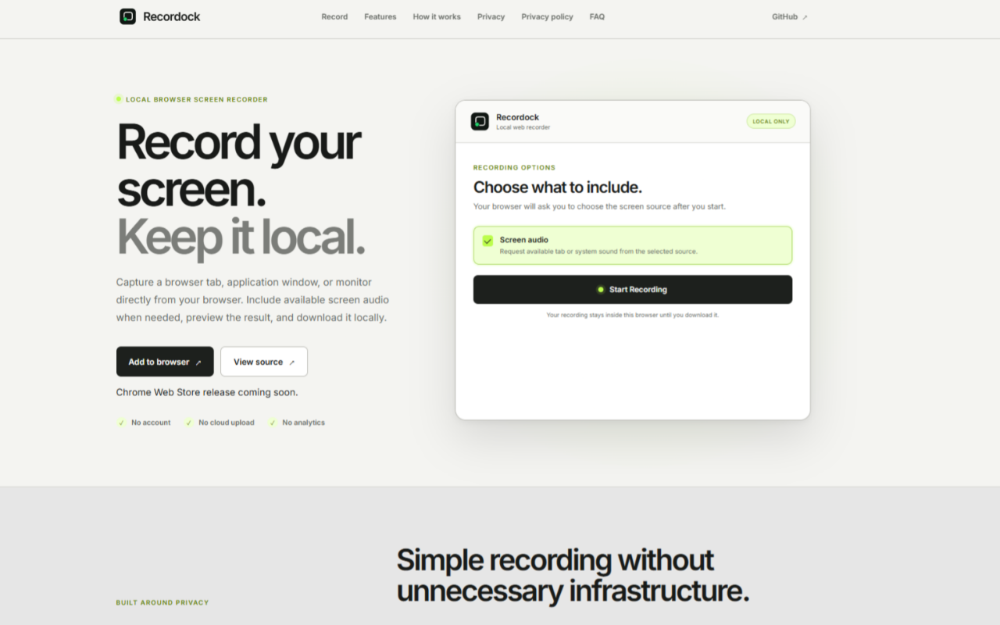
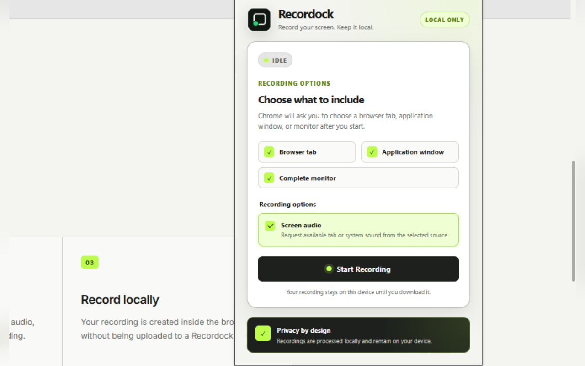
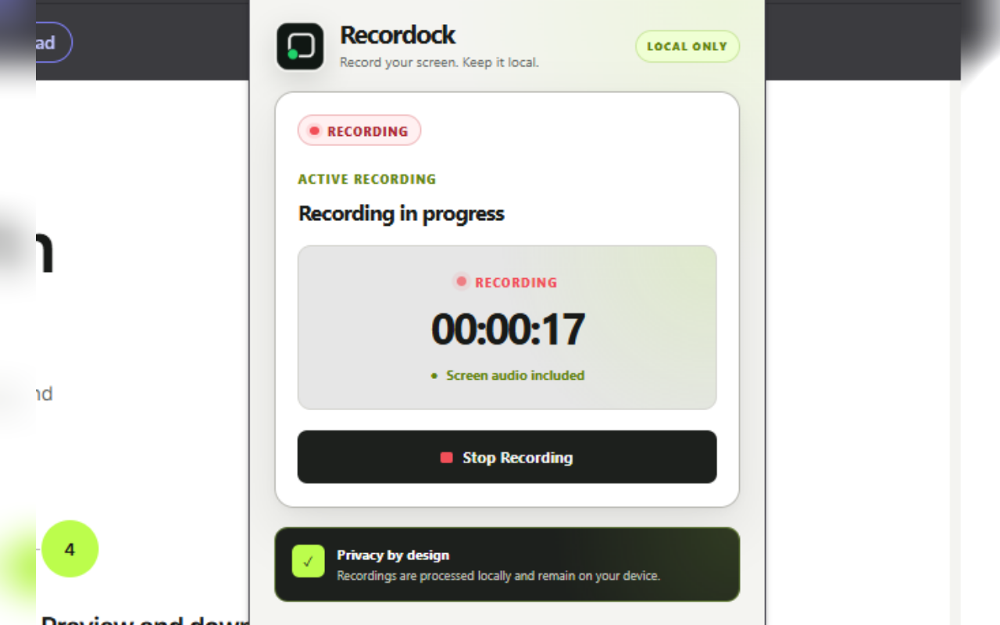
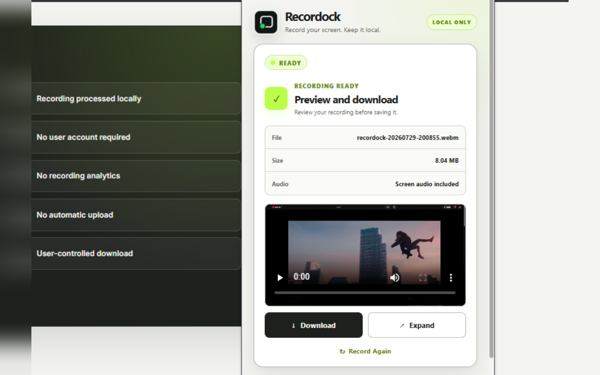
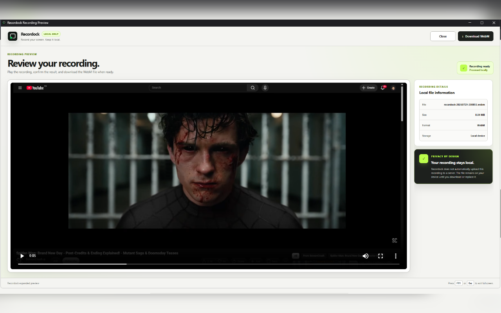

# Recordock

**Record your screen. Keep it local.**

Recordock is a privacy-focused screen recorder for Chrome. It can capture a browser tab, application window, or monitor, optionally include available source audio, preview the completed recording, and save it locally as a WebM file.

The repository contains:

- A Manifest V3 Chrome extension
- A local browser-based screen recorder
- A public landing page
- Automated tests and technical documentation

## Current version

`0.1.0`

Recordock is under active development. The current implementation supports the complete local recording workflow without requiring an account, backend, or cloud-storage service.

## Product model

Recordock is being developed with free and premium product tiers.

This public repository contains the free version of Recordock. Selected advanced capabilities may require a Recordock Premium subscription in future releases.

Premium features, subscription services, payment handling, entitlement verification, and other proprietary components will be maintained separately and will not be included in this public repository.


## Features

### Chrome extension

- Record a browser tab
- Record an application window
- Record a complete monitor
- Optionally request tab or system audio
- Continue recording after the popup closes
- Display recording status and elapsed time
- Stop from the popup or Chrome’s native sharing controls
- Preserve the latest recording locally
- Preview recordings inside the popup
- Open an expanded preview window
- Download recordings as WebM files
- Record again without restarting the extension

### Browser recorder

The landing page also includes a local web recorder that can:

- Capture a browser tab, window, or monitor
- Optionally request available screen audio
- Preview the completed recording
- Download the recording locally
- Operate without an account or backend

Unlike the Chrome extension, the browser recorder requires the landing-page tab to remain open while recording.

## Privacy

Recordock is designed around local processing.

- Recordings are not automatically uploaded
- No Recordock backend receives the video
- No user account is required
- No cloud-storage account is required
- No recording analytics are collected
- Downloads are initiated by the user
- Recording files remain under the user's control

The Chrome extension stores the latest completed recording locally in IndexedDB so it can be previewed and downloaded.

## Architecture

The extension separates the user interface from the recording engine.

```text
Popup
  │
  │ Chrome runtime messages
  ▼
Service worker
  │
  │ Creates and coordinates
  ▼
Offscreen document
  │
  │ getDisplayMedia + MediaRecorder
  ▼
Local WebM recording
  │
  ├── IndexedDB blob storage
  └── chrome.storage.session state
```

### Popup

The popup allows the user to:

- Choose whether to request screen audio
- Start and stop recordings
- View the active timer
- Preview the latest completed recording
- Download or expand the preview

### Service worker

The Manifest V3 service worker coordinates:

- Popup messages
- Offscreen-document creation
- Recording commands
- Extension badge state
- Recording-state synchronization

### Offscreen document

The offscreen document owns the long-running browser media APIs:

- `navigator.mediaDevices.getDisplayMedia`
- `MediaRecorder`
- Media-stream track lifecycle
- Recording completion
- Blob creation

This allows recording to continue after the extension popup closes.

### Local storage

Recordock uses:

- `chrome.storage.session` for lightweight recording state
- IndexedDB for the latest completed recording blob

## Technology stack

### Extension

- React
- TypeScript
- Vite
- Manifest V3
- Chrome Extensions API
- Media Capture and Streams API
- MediaRecorder API
- IndexedDB
- Vitest
- React Testing Library
- Oxlint

### Landing page

- React
- TypeScript
- Vite
- Media Capture and Streams API
- MediaRecorder API

## Project structure

```text
recordock/
├── brand-assets/
│   └── Recordock visual assets
│
├── docs/
│   └── Technical and privacy documentation
│
├── extension/
│   ├── public/
│   │   ├── icons/
│   │   └── manifest.json
│   │
│   ├── src/
│   │   ├── offscreen/
│   │   ├── popup/
│   │   ├── preview/
│   │   ├── storage/
│   │   ├── tests/
│   │   ├── types/
│   │   ├── utils/
│   │   ├── App.tsx
│   │   └── index.css
│   │
│   └── package.json
│
├── landing-page/
│   ├── public/
│   ├── src/
│   └── package.json
│
└── README.md
```

## Running the Chrome extension locally

### Prerequisites

- Node.js
- npm
- Google Chrome version 116 or later

### Install dependencies

```powershell
cd extension
npm install
```

### Validate the extension

```powershell
npm run validate
```

The validation command runs:

```text
Lint
Tests
Production build
```

The current automated suite contains tests for:

- Popup recording states
- Audio-option behavior
- Recording preview controls
- IndexedDB recording storage
- Duration formatting
- File-size formatting
- Recording filename generation

### Build the extension

```powershell
npm run build
```

### Load the extension in Chrome

1. Open:

   ```text
   chrome://extensions
   ```

2. Enable **Developer mode**.

3. Select **Load unpacked**.

4. Choose:

   ```text
   recordock/extension/dist
   ```

5. Pin Recordock to the Chrome toolbar.

After making code changes, rebuild the extension and click **Reload** on the Chrome extensions page.

## Testing the recording workflow

### Screen audio

1. Open the Recordock popup.
2. Keep **Screen audio** enabled.
3. Click **Start Recording**.
4. Choose a browser tab that is playing audio.
5. Enable Chrome’s **Share tab audio** option.
6. Start sharing.
7. Reopen Recordock.
8. Stop the recording.
9. Confirm that the preview displays:

   ```text
   Screen audio included
   ```

### Video only

1. Disable **Screen audio**.
2. Start a recording.
3. Select a source.
4. Stop the recording.
5. Confirm that the preview displays:

   ```text
   Video only
   ```

### Additional checks

Verify that:

- Recording continues after the popup closes
- The elapsed timer restores when the popup reopens
- Chrome’s native **Stop sharing** action completes the recording
- The preview loads
- Download works
- Expanded preview works
- Record Again works
- No service-worker or popup errors appear

## Running the landing page locally

```powershell
cd landing-page
npm install
npm run dev
```

Open the local URL printed by Vite.

### Build the landing page

```powershell
npm run lint
npm run build
```

The deployed landing page must use HTTPS for browser screen-capture functionality.

## Screenshots

### Landing Page

<p align="center">
  
</p>

### Chrome Extension

<p align="center">
  
  &nbsp;
  
  &nbsp;
  
</p>

<p align="center">
  <sub>
    Ready to record · Recording in progress · Recording completed
  </sub>
</p>

### Expanded Recording Preview

<p align="center">
  
</p>

## Current limitations

- Chrome 116 or later is required
- Recordings are exported only as WebM
- Microphone capture is not yet available
- Camera overlay is not yet available
- Only the latest completed extension recording is retained
- Available source audio depends on the selected source and Chrome’s sharing options
- Recordings are not synchronized between devices
- There is no cloud backup
- The browser recorder stops if its page is closed or refreshed

## Roadmap

Planned future work includes:

- Microphone recording
- Screen-audio and microphone mixing
- Movable camera overlay
- Recording-resolution controls
- Recording-quality controls
- Improved recording history
- Additional export formats
- User accounts
- Recordock Premium subscriptions
- Premium feature-access controls
- Secure entitlement verification
- Chrome Web Store release
- Deployed landing page
- Expanded automated test coverage

The exact division between free and premium capabilities will be finalized before the commercial release.

## Development branches

Recordock preserves completed development branches instead of deleting them. This keeps the repository’s implementation history visible.

Key branches include:

```text
project-foundation
recording-engine
recording-controls
audio-capture
testing-documentation
landing-page
popup-theme
landing-page-recorder
extension-lime-gray-theme
expanded-preview-theme
repository-documentation
```

The `main` branch contains the integrated current version.

## Repository

GitHub:

```text
https://github.com/jayasuryapazhani/recordock
```

## Rights

Copyright © 2026 Jayasurya Pazhani. All rights reserved.

This repository is publicly viewable for reference and portfolio purposes. No license is granted to copy, modify, redistribute, sublicense, sell, or commercially use this software without explicit written permission from the copyright owner, except where otherwise permitted by applicable law.

## Author

Built by [Jayasurya Pazhani](https://github.com/jayasuryapazhani).